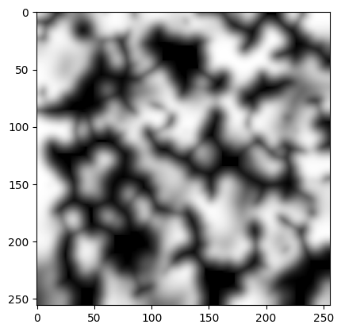
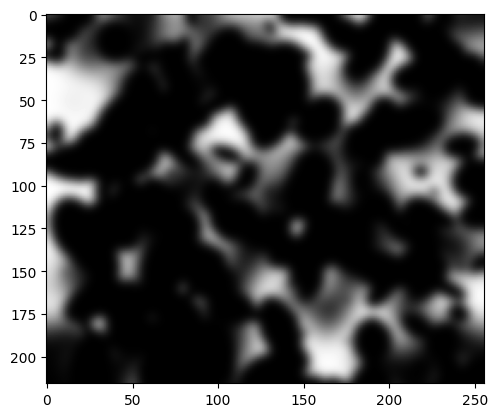
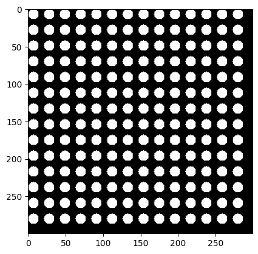
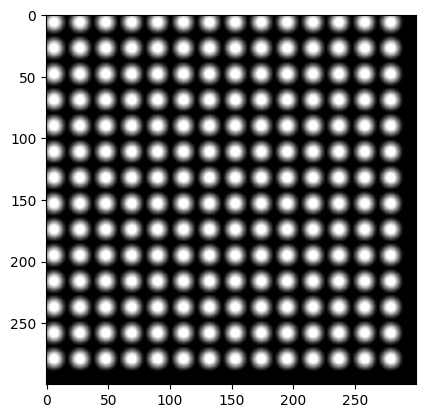
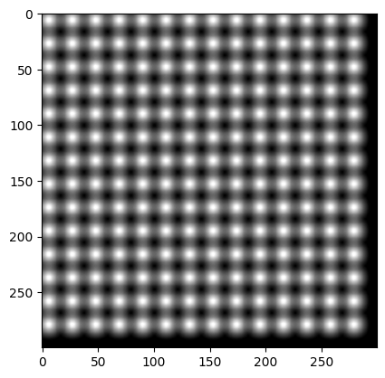
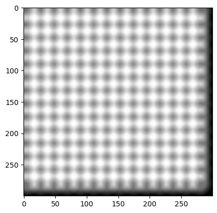
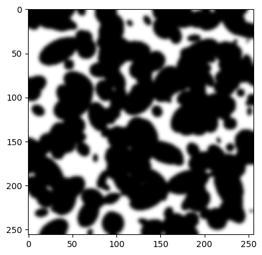

# komorebi
sunlight filtering through trees

cut out holes in a sheet of payper and play in the sun,
[short video] (https://youtube.com/shorts/05zTaUEyhlc?si=YrmlXLZLmC7IlnCp)

tried to emulate it by stacking (multiplying) layers blurred random ellipses:

One layer

Two layers

https://github.com/user-attachments/assets/78c0919e-8389-40a7-a0c1-92b9deae85da

did systematic experiments with a cheese grater

[short video] (https://youtu.be/CNX8Lc9OP34?si=c_FgE2Z_knYCC9FQ)

realised that blurred circles can not reproduce the effect
remembered that a an interrupted planar wave is equivalent to ininetly many point emmiters along its cut
implemented a confolution between one circle and a pattern of many circles

it looks very similar to the experimental cheesegrater results:

did the convolution for a single layer of leaves, looks good, this might be the right direction

stuck at figuring out how to do several layers of leaves, something about rescaling, 
because further down in the tree the sun has not changed in apparent size, 
but the leaves further up are now relatively smaller
