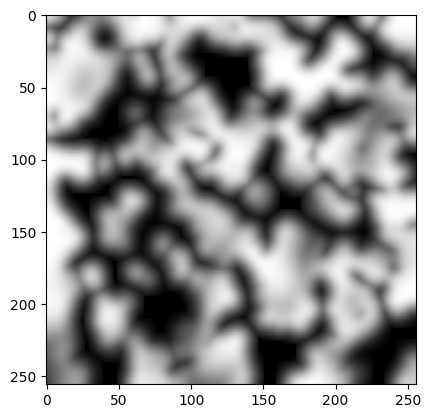
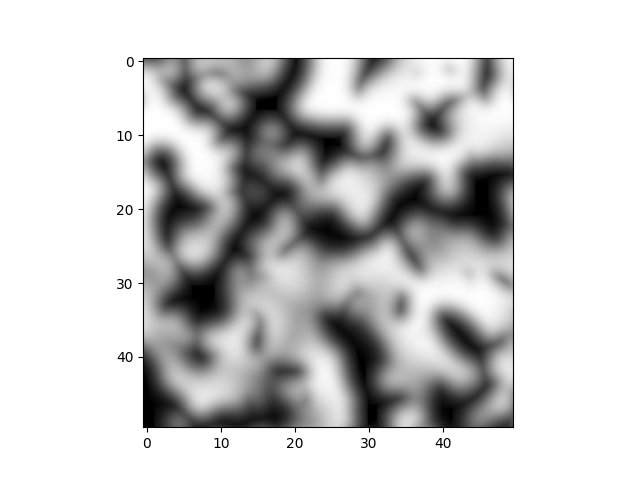
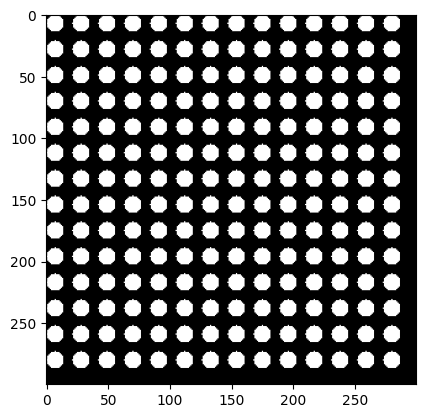
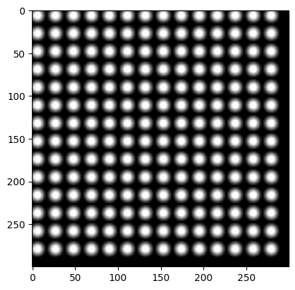
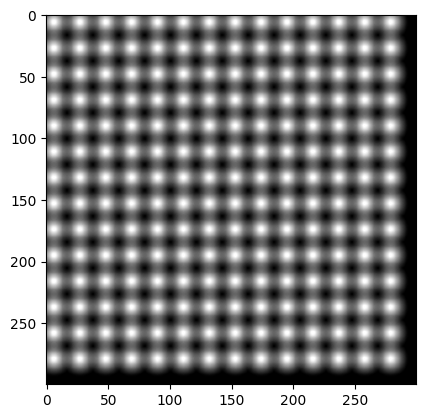
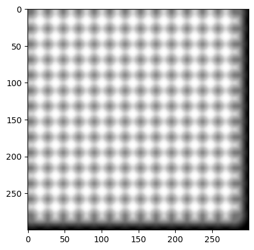
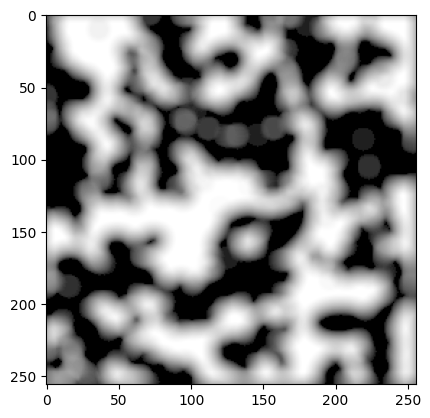

cut out holes in a sheet of payper and play in the sun,
[short video] (https://youtube.com/shorts/05zTaUEyhlc?si=YrmlXLZLmC7IlnCp)

tried to emulate it by stacking (multiplying) layers blurred random ellipses:

One layer

Two layers

https://github.com/user-attachments/assets/78c0919e-8389-40a7-a0c1-92b9deae85da

did systematic experiments with a cheese grater

[short video] (https://youtu.be/CNX8Lc9OP34?si=c_FgE2Z_knYCC9FQ)

realised that blurred circles can not reproduce the effect, it just becomes uniformly gray, the
"dark circles on light background" do not happen

remembered that a an interrupted planar wave is equivalent to infinetly many point emmiters along its cut

implemented a convolution between one circle and a pattern of many circles

it looks very similar to the experimental cheesegrater results:

did the convolution for a single layer of leaves, looks good, this might be the right direction

